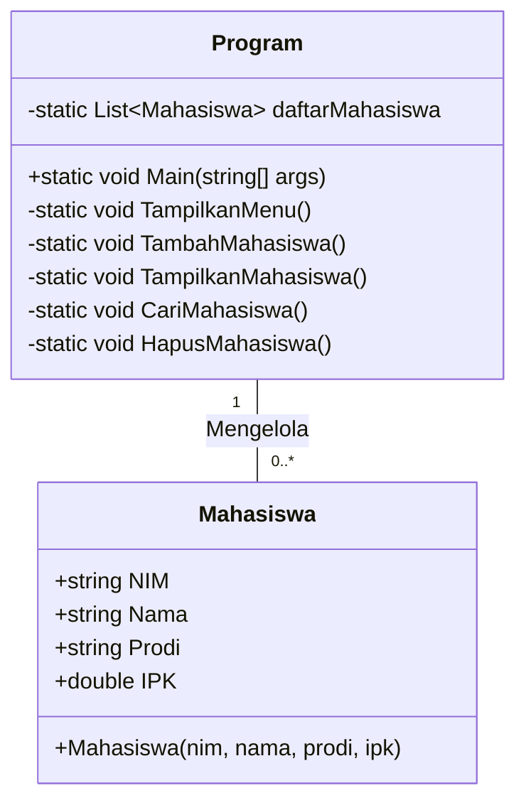

# Tugas-PBKK-Pertemuan-Ke-2

|    Identity |           Notes            |
| :-------------- |       :-----------------       |
| Nama | Muhammad Daffa Ramadhan    |
| NRP | 5025241216 | 
| Mata Kuliah |     Pemrograman Berbasis Kerangka Kerja        | 
| Kelas | D | 

## 1. Hello World

```cs

Console.WriteLine("Hello, World!");

```

karena versi .net 6 ke atas, Microsoft memperkenalkan fitur yang dinamakan Top-Level Statements.

Dengan fitur ini, saya bisa langsung menuliskan logika utama program secara ringkas tanpa perlu menggunakan static/using system seperti ini:

```cs

// Kode gaya LAMA (sebelum .NET 6)
using System;

namespace contohAja
{
    class Program
    {
        static void Main(string[] args)
        {
            Console.WriteLine("Hello, World!");
        }
    }
}

```
### Source Code

```cs

Console.WriteLine("Hello, World!");

```

### Output yang dihasilkan adalah


untuk run code-nya kita harus gunakan `dotnet run`

## 2. Sistem Database Mahasiswa with CRUD


### 2.1 Fitur Utama

- **Tambah Mahasiswa**: Menambahkan data mahasiswa baru (NIM, Nama, Prodi, IPK) dengan validasi input angka.
- **Tampilkan Mahasiswa**: Menampilkan daftar seluruh mahasiswa dalam format tabel konsol yang rapi.
- **Cari Mahasiswa**: Mencari data spesifik berdasarkan NIM.
- **Hapus Mahasiswa**: Menghapus data mahasiswa dari daftar berdasarkan NIM.
- **Keluar**: Dilengkapi dengan pembersihan layar otomatis (`Console.Clear()`) dan navigasi.

### 2.2 Arsitektur & Struktur Kode

Aplikasi ini terdiri dari dua kelas utama yang berada dalam *namespace* `DataMahasiswa`:



### 2.3 Penjelasan Kode

### 2.3.1 Model Data (`Program.cs`)

Menggunakan fitur **Auto-Implemented Properties** C# untuk enkapsulasi atribut mahasiswa secara bersih dan ringkas.

```csharp
class Mahasiswa
{
    public string NIM { get; set; }
    public string Nama { get; set; }
    public string Prodi { get; set; }
    public double IPK { get; set; }

    public Mahasiswa(string nim, string nama, string prodi, double ipk)
    {
        NIM = nim;
        Nama = nama;
        Prodi = prodi;
        IPK = ipk;
    }
}
```


### 2.3.2 Validasi Input IPK

Pada metode `TambahMahasiswa()`, diadakan perulangan `while(true)` dan pemrosesan `double.TryParse()` untuk memastikan program tidak kena *runtime error* (crash) apabila pengguna memasukkan teks non-angka atau nilai di luar jangkauan `0.0 - 4.0`.

```csharp
double ipk;
while (true)
{
    Console.Write("IPK (0 - 4)   : ");
    if (double.TryParse(Console.ReadLine(), out ipk))
    {
        if (ipk >= 0 && ipk <= 4)
        {
            break; // Input valid, keluar dari loop
        }
    }
    Console.WriteLine("IPK harus berupa angka rentang 0 - 4.");
}
```

### 2.3.3 Output Format Tabel Konsol
Daftar mahasiswa ditampilkan secara sejajar dan teratur menggunakan *Composite Formatting* C#:
- `{0,-12}`: Indeks ke-0, rata kiri dengan lebar 12 karakter.
- `{3,5:F2}`: Indeks ke-3, rata kanan 5 karakter dengan format 2 digit desimal (`F2`).

```csharp
Console.WriteLine("{0,-12} {1,-20} {2,-20} {3,5}", "NIM", "Nama", "Prodi", "IPK");
foreach (Mahasiswa m in daftarMahasiswa)
{
    Console.WriteLine("{0,-12} {1,-20} {2,-20} {3,5:F2}", m.NIM, m.Nama, m.Prodi, m.IPK);
}
```

### 2.3.4 Pencarian Case-Insensitive
Metode pencarian dan penghapusan NIM memanfaatkan `StringComparison.OrdinalIgnoreCase` sehingga pencarian huruf kapital dan kecil (misal: `m01` vs `M01`) dianggap sama.

```csharp
if (m.NIM.Equals(nimCari, StringComparison.OrdinalIgnoreCase))
{
    mahasiswaDitemukan = m;
    break;
}
```

### Langkah-langkah buat menjalankan
1. **Jalankan Aplikasi**:
   ```bash
   dotnet run
   ```

### Contoh Output Aplikasinya

```text
========================================
         SISTEM DATA MAHASISWA           
========================================
1. Tambah Mahasiswa
2. Tampilkan Mahasiswa
3. Cari Mahasiswa
4. Hapus Mahasiswa
5. Keluar
========================================
Pilihan: 2

==========================================================
                  DAFTAR MAHASISWA                        
==========================================================
NIM          Nama                 Prodi                  IPK
----------------------------------------------------------
230101001    Muhammad Daffa Ramadhan        Teknik Informatika    3.85
230101002    Fiorentina Flora           Sistem Informasi      3.90
==========================================================
```

### Video Uji Coba Output

https://github.com/user-attachments/assets/252d9f20-389e-4afd-b99f-6afc46160ac9

> [!TIP]
> Karena data disimpan secara in-memory di dalam `List<Mahasiswa>`, data akan tersimpan selama aplikasi berjalan dan nanti akan ke reset di saat program dihentikan.


Copyright by Muhammad Daffa Ramadhan Departemen Teknik Informatika Fakultas Teknologi Elektro dan Informatika Cerdas Institut Teknologi Sepuluh Nopember.
